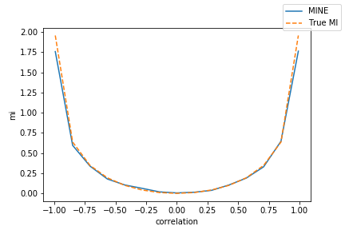
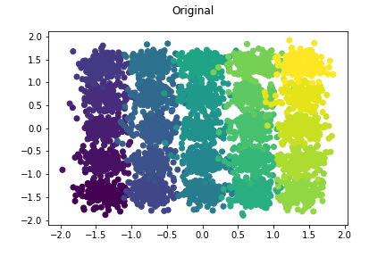
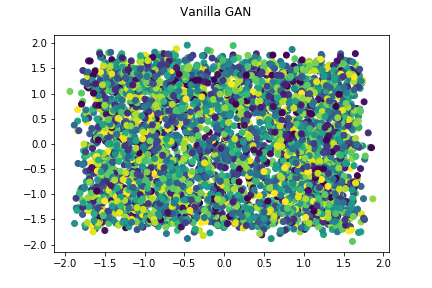
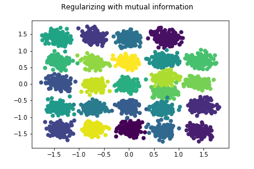

# Mutual Information Neural Estimation

## Why is this cool

Minimizing a common loss function such as cross-entropy loss is equivalent to minimizing a similar metric, the Kullback-liebler divergence between two probability distributions X (the input) and Y (the target variable). The KL-divergence measures the "distance" between two probability distributions by considering the difference in entropy or uncertainty between samples generated from the true target distribution to those predicted by your model.
The mutual information of a joint distribution p(X,Y) is the KL-divergence between the joint distribution and the product of the marginal distributions or equivalently the difference in uncertainty of r.v X given that we know Y.

Mutual information is an important metric since its a measure of non-linear dependence between variables. In particular, it arises in many machine learning problems where good representations of the data are studied. A good representation can be thought of as a vector where the components are pairwise independent. An example would be representing an image as a vector with components denoting hair style, eye color etc. For example, InfoGAN [1] uses a mutual information estimate in the GAN value function to train a network which can sample independent features from the raw data.

It is also an interesting metric in the study of Neural Networks themselves. It has been empirically observed in convolutional networks that the first layers in a network learn lower level features like shape and color while the top level layers learn higher level features. A hypothesis [2] is that as Networks learn, the intermediate layers learn first to minimize the mutual information between its representations and the inputs and then try to maximize the mutual information between the representation and the target variable. This is known as the Information Bottleneck theory and has only recently been applied to Neural Networks. 

Many mutual information estimators have been proposed in recent years as the interest in information-theoretic methods has grown. Mutual Information Neural Estimators [3] provide accurate estimates of Mutual Information and is easy to combine with existing models. This repo aims to reproduce the results of the paper and provide simple building blocks to incorporate mutual information into your own models. 

## Setup

```
git clone github.com/gtegner/mine-pytorch
cd mine-pytorch
pip install -r requirements.txt
```

Some of the code uses Pytorch Lightning [4] for training and evaluation. 

## Experiments

This repo contains a Pytorch implementation of MINE and a reconstruction of most of the experiments
Currently this includes:

1. Comparing MINE to non-parametric estimation
2. Capturing non-linear dependencies
3. Maximizing mutual information to improve GANs

- [x] Spiral dataset
- [x] 25 Gaussians
- [ ] Stacked MNIST

4. Improving Bi-directional adversarial models

- [x] 25 Gaussians

5. Information bottleneck

- [x] Permutation invariant MNIST
- [ ] Reconstructing results from Tishby et al. (2016)

The implemented experiments can be found in the `All Experiments.ipynb` notebook. 

## Usage

MINE relies on a statistics network `T` which takes as input two variables X, Y and estimates the mutual information MI(X,Y).

```python
from mine import Mine
statistics_network = nn.Sequential(
    nn.Linear(x_dim + y_dim, 100),
    nn.ReLU(),
    nn.Linear(100, 100),
    nn.ReLU(),
    nn.Linear(100, 1)
)

mine = Mine(
    T = statistics_network,
    loss = 'mine' #mine_biased, fdiv
    method = 'concat'
)

joint_samples = np.random.multivariate_normal(mu = np.array([0,0]), cov = np.array([[1, 0.2], [0.2, 1]]))

X, Y = joint_samples[:, 0], joint_samples[:, 1]

mi = mine.optimize(X, Y, iters = 100)
```

## Results
### Mutual Information between normal random variables
We estimate the MI for two normal distributed random variables with varying correlation. 



### MINE + GAN
We combine MINE with Generative Adversarial Networks by adding a regularization term to the GAN value function which measures the mutual information between the generated samples and the image labels.
The generator also receives as input the concatenation of random noise Z and one-hot encoded label c. 


Note that the distribution of the generated samples is much closer to the true distribution than that of a normal GAN. However, the labels do not coincide with the true labels. By maximizing mutual information between
samples and labels, we ensure that generated samples from the same class will stick together in the sample space. There is however no objective that ensures that random noise z together with class label c is mapped to the same class in the data distribution, the discriminator can only determine if it is in the distribution at all. 






### References
- [1] https://arxiv.org/pdf/1606.03657.pdf
- [2] https://arxiv.org/pdf/1703.00810.pdf
- [3] https://arxiv.org/pdf/1801.04062.pdf
- [4] https://github.com/PyTorchLightning/pytorch-lightning


